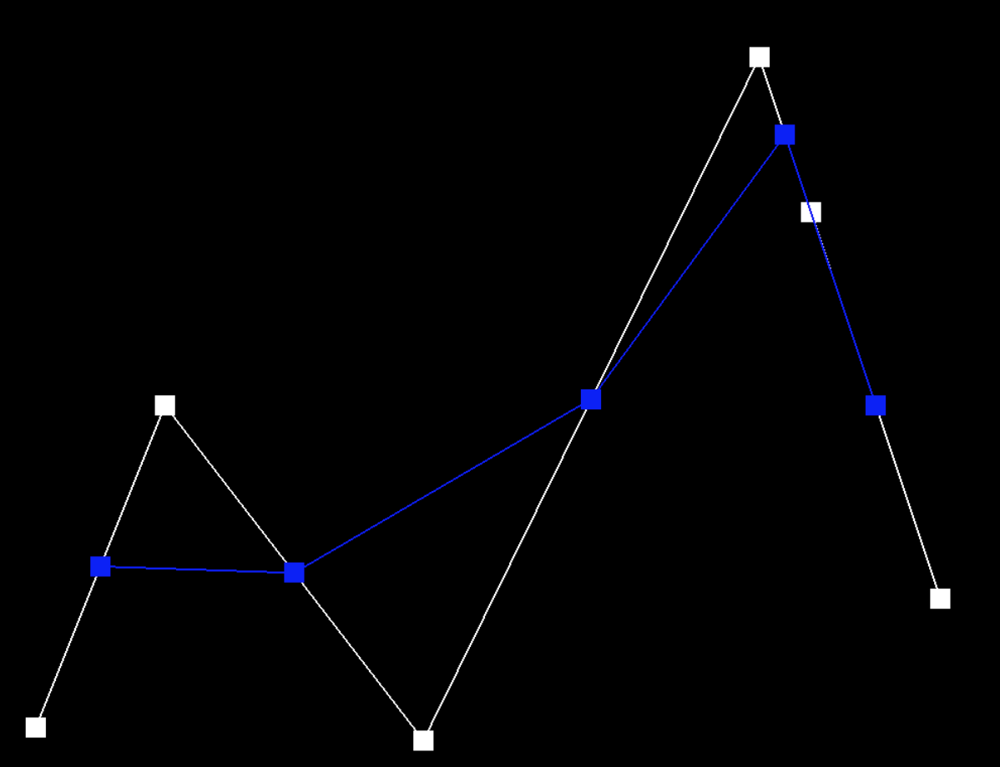
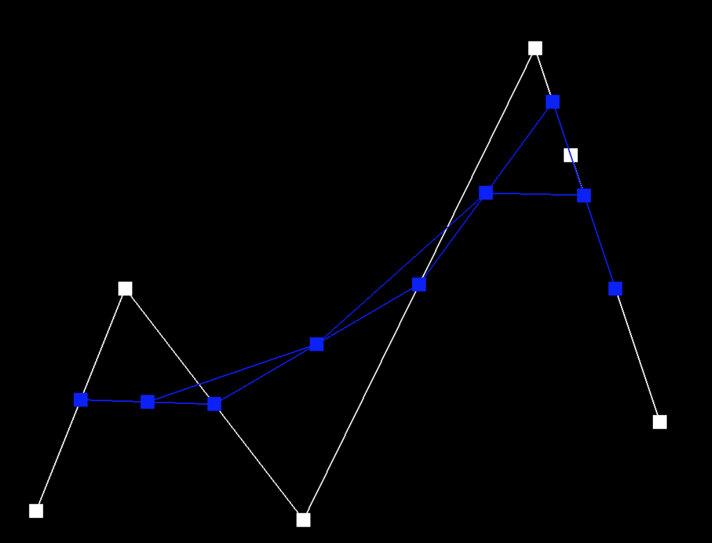
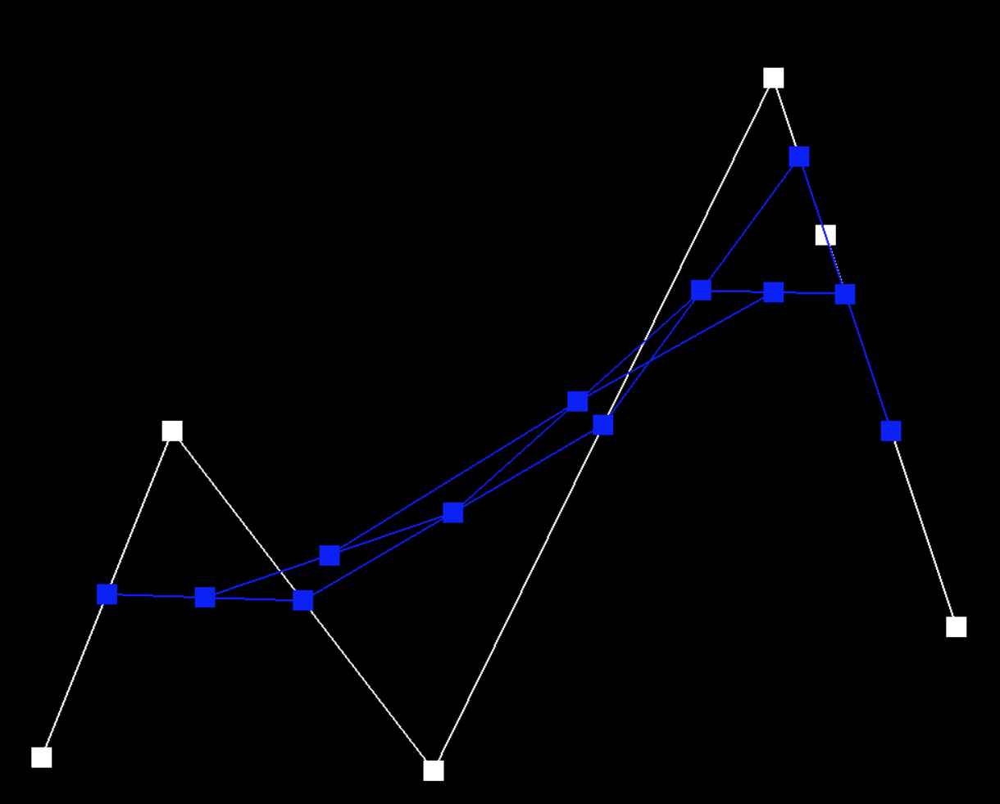
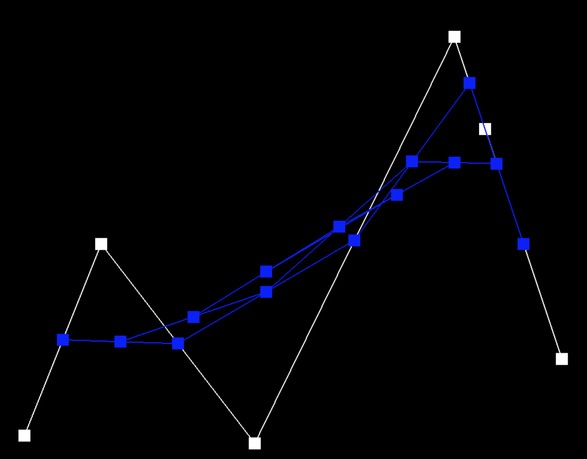
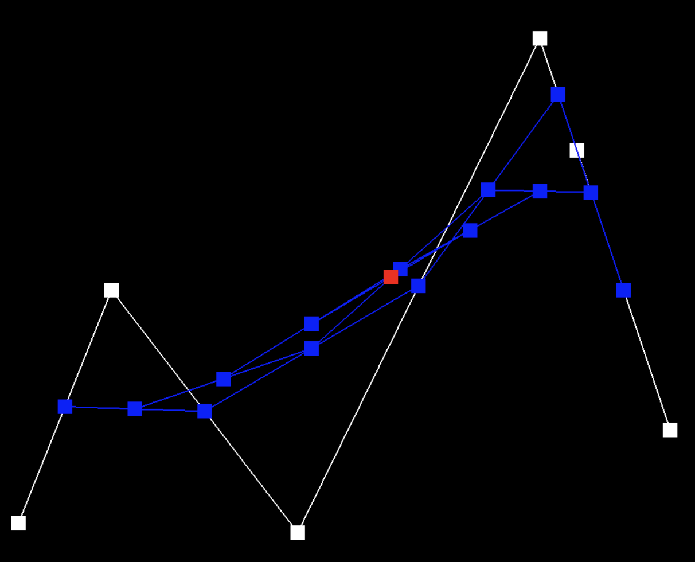
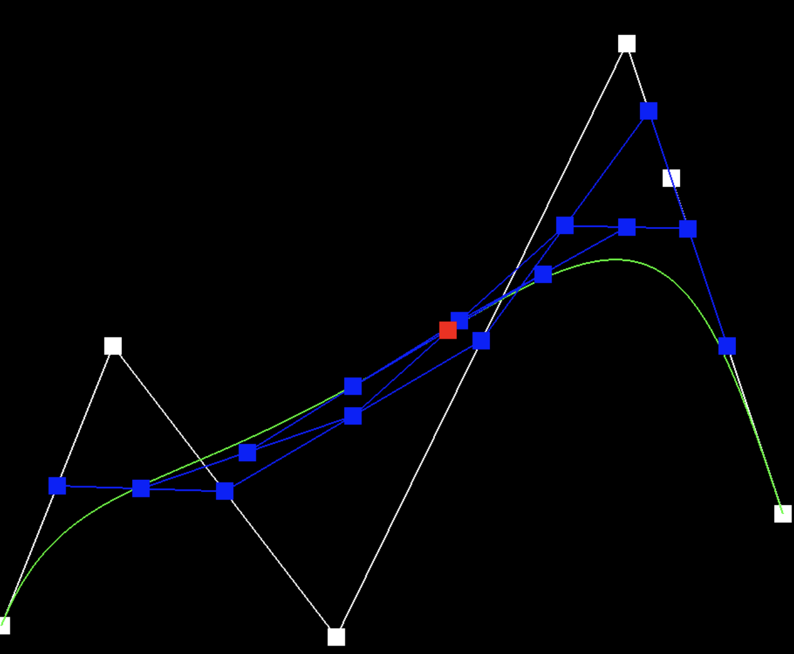
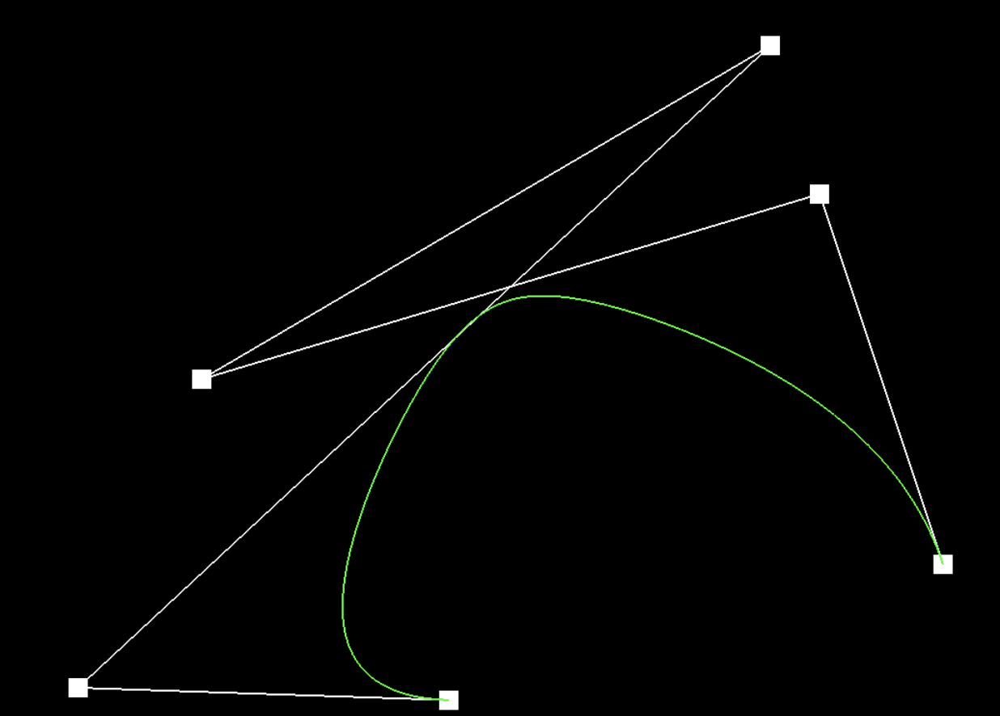
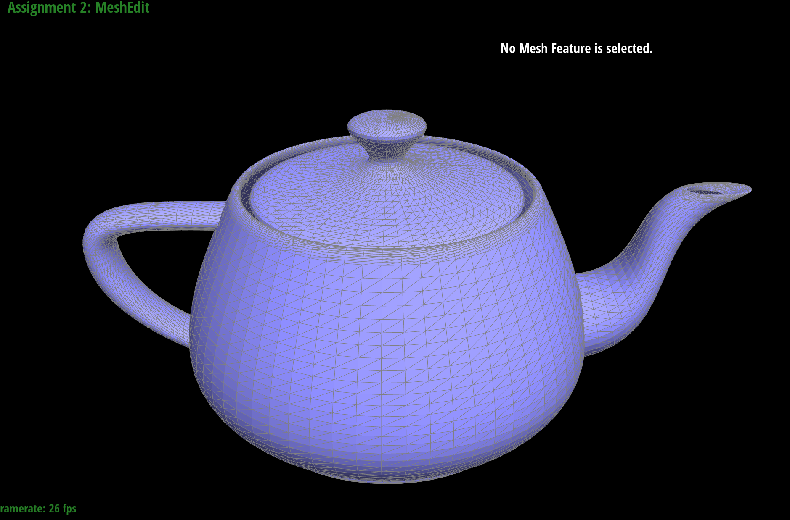
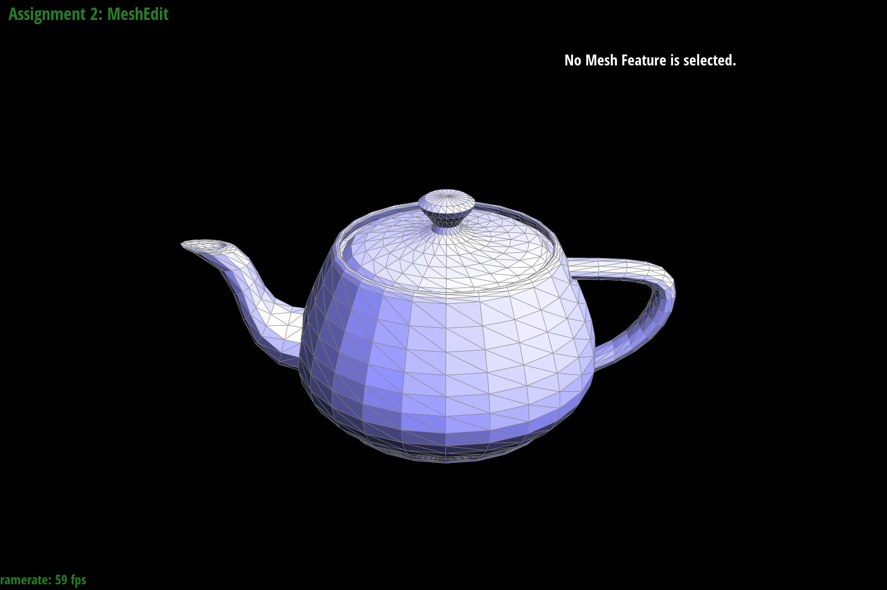
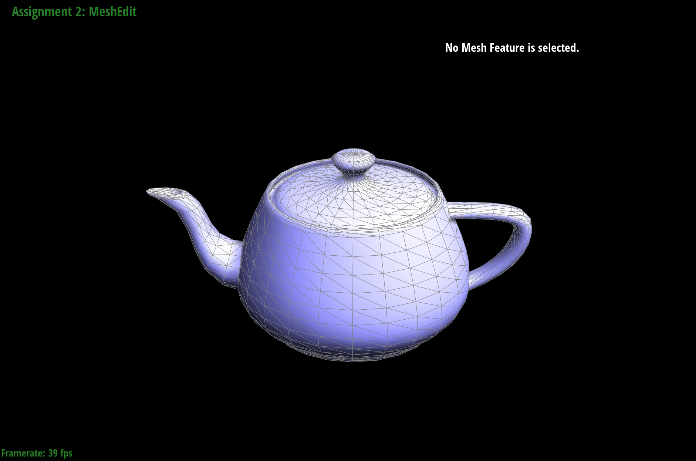

# CS 184: Computer Graphics and Imaging, Spring 2023

## Project 2: MeshEdit
## Michael Lin, Rachel Lee
 *** 
### Overview
### Task 1: Bezier Curves with 1D de Casteljau Subdivision
- **Briefly explain de Casteljau's algorithm and how you implemented it in order to evaluate Bezier curves.**
    - De Casteljau’s algorithm is useful for evaluating Bezier curves provided a set of control points. The algorithm essentially uses linear interpolation to create subdivisions of the curve by adding a new point along each line segment edge and dividing it into new line segments. We calculate the new point at a given parameter t by using the formula: ```p'_i = lerp(p_i, p_(i+1), t) = (1-t)*p_i + t*p_(i+1)```
    - In ```evaluateStep```, we iteratively calculate a new point from the set of control (or intermediate) points provided in the input using the above formula ```points.size() - 1``` times. Then, we add the new point to the 2D vector result and return the updated vector array containing the interpolated points.
- **Take a look at the provided .bzc files and create your own Bezier curve with 6 control points of your choosing. Show screenshots of each step / level of the evaluation from the original control points down to the final evaluated point. Press E to step through. Toggle C to show the completed Bezier curve as well.**
    - ```task1.bzc```:
    
    
    
    
    
    
    
- **Show a screenshot of a slightly different Bezier curve by moving the original control points around and modifying the parameter**
    - ```task1-modified.bzc```:
    
 *** 
### Task 2: Bezier Curves with 1D de Casteljau Subdivision
- **Briefly explain how de Casteljau algorithm extends to Bezier surfaces and how you implemented it in order to evaluate Bezier surfaces.**
    - We can extend de Casteljau’s algorithm from evaluating Bezier curves to surfaces by taking a n x n grid of control points (rather than a single array) and calculate intermediate points along each curve of a row of points to evaluate the surface position corresponding to the parameters (u,v). Each row contains n control points ${P_{i0}, …, P_{i(n-1)}}$ parameterized by u and we can recursively apply de Casteljau’s algorithm to evaluate a point v on the “moving” Bezier curves in u. In our implementation, we do this by taking the n x n input vector points of control points and applying de Casteljau’s algorithm to each row in the vector.
- **Show a screenshot of bez/teapot.bez (not .dae) evaluated by your implementation.**
    - 


### Task 3: Area-Weighted Vertex Normals
- **Briefly explain how you implemented the area-weighted vertex normals.**
    - To compute the area-weighted normal at a given vertex, we first iterated through the triangle faces neighboring the vertex using the ```face()``` and ```next()``` methods in the half edge data structure. We also called ```vertex()->position``` to get the neighboring vertices and their corresponding positions. Then, for each adjacent face we found the normal vector by calculating the cross product of the two edge vectors of the face and multiplied by its area. The result is then added to a 3D Vector result which keeps track of the current neighboring cross products calculated so far. Finally, we return the result’s unit vector. 
- **Show screenshots of dae/teapot.dae (not .bez) comparing teapot shading with and without vertex normals. Use Q to toggle default flat shading and Phong shading.**
    - Default shading:
        
    - Phong shading:
        

### Task 4: Edge Flip
- **Briefly explain how you implemented the edge flip operation and describe any interesting implementation / debugging tricks you have used.**
- **Show screenshots of a mesh before and after some edge flips.**
- **Write about your eventful debugging journey, if you have experienced one.**
