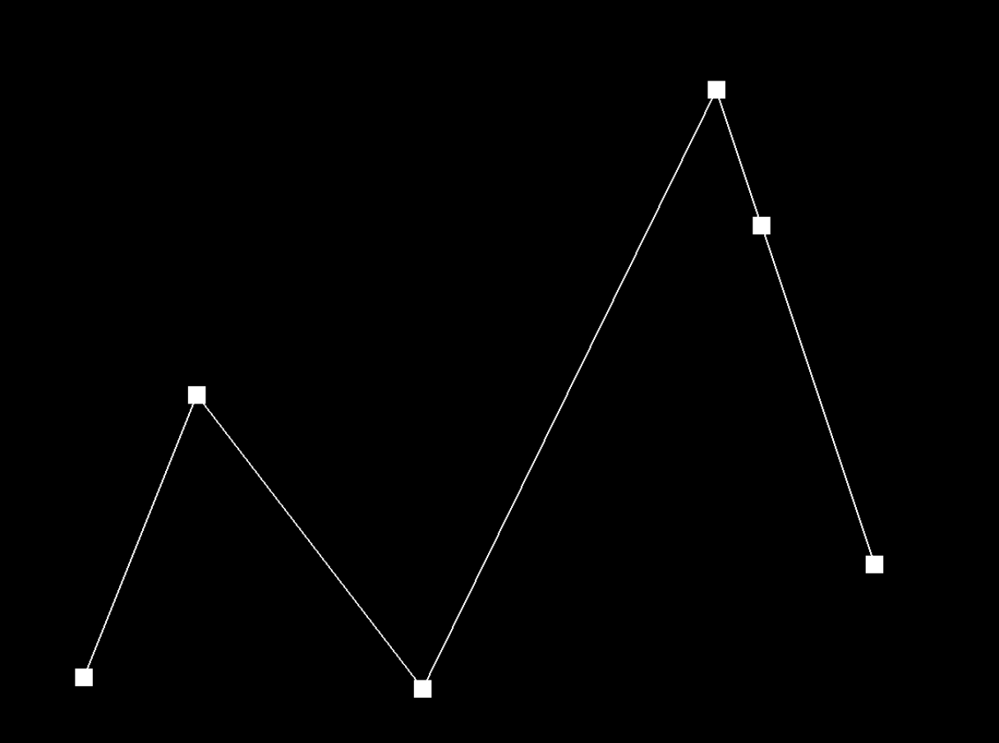
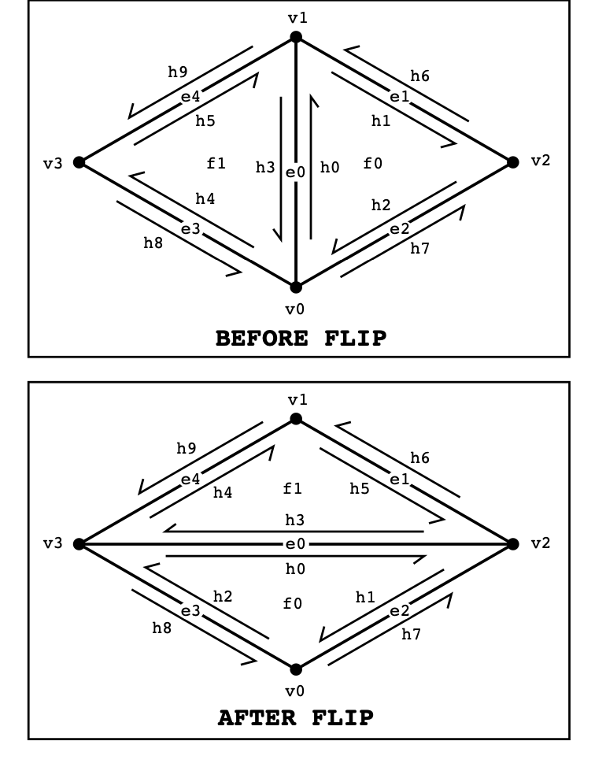
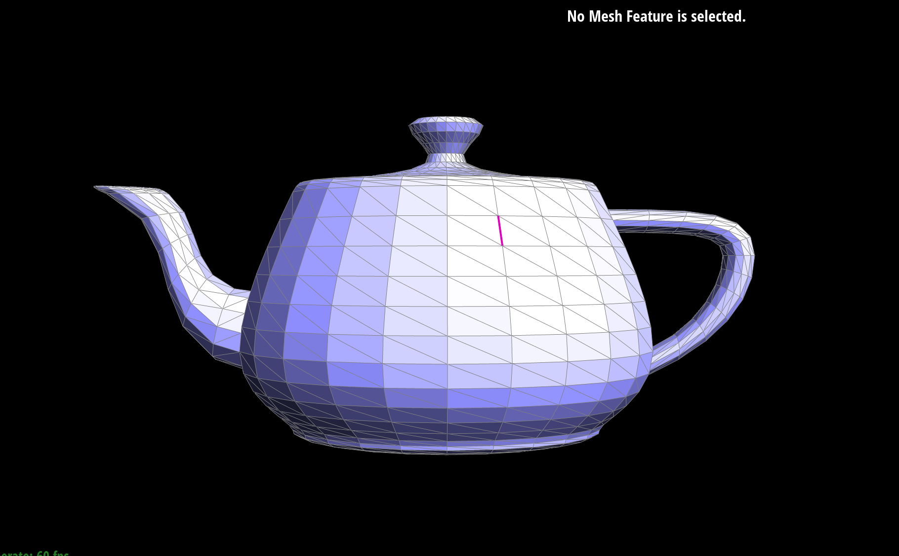
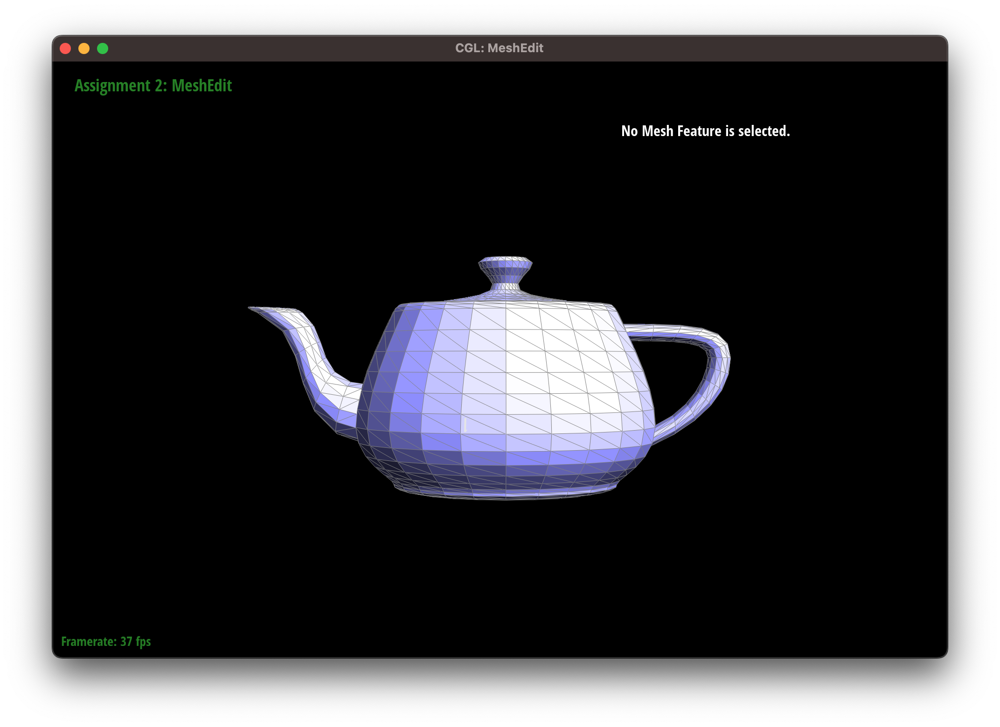
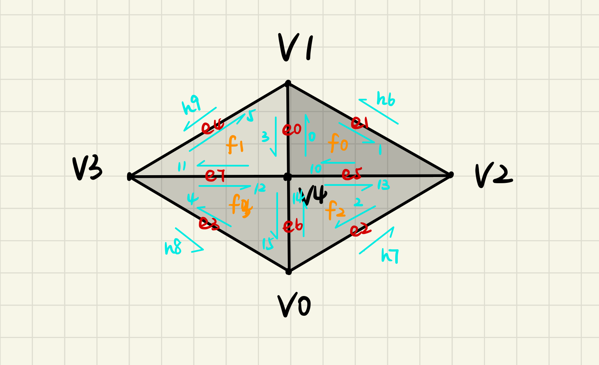

# CS 184: Computer Graphics and Imaging, Spring 2023

## Project 2: MeshEdit
## Michael Lin, Rachel Lee
 *** 
### Overview
### Task 1: Bezier Curves with 1D de Casteljau Subdivision
- **Briefly explain de Casteljau's algorithm and how you implemented it in order to evaluate Bezier curves.**
    - De Casteljau’s algorithm is useful for evaluating Bezier curves provided a set of control points. The algorithm essentially uses linear interpolation to create subdivisions of the curve by adding a new point along each line segment edge and dividing it into new line segments. We calculate the new point at a given parameter t by using the formula: ```p'_i = lerp(p_i, p_(i+1), t) = (1-t)*p_i + t*p_(i+1)```
    - In ```evaluateStep```, we iteratively calculate a new point from the set of control (or intermediate) points provided in the input using the above formula ```points.size() - 1``` times. Then, we add the new point to the 2D vector result and return the updated vector array containing the interpolated points.
- **Take a look at the provided .bzc files and create your own Bezier curve with 6 control points of your choosing. Show screenshots of each step / level of the evaluation from the original control points down to the final evaluated point. Press E to step through. Toggle C to show the completed Bezier curve as well.**
    - ```task1.bzc```:
    
    
    
    
    
    
    
- **Show a screenshot of a slightly different Bezier curve by moving the original control points around and modifying the parameter**
    - ```task1-modified.bzc```:
    
 *** 
### Task 2: Bezier Curves with 1D de Casteljau Subdivision
- **Briefly explain how de Casteljau algorithm extends to Bezier surfaces and how you implemented it in order to evaluate Bezier surfaces.**
    - We can extend de Casteljau’s algorithm from evaluating Bezier curves to surfaces by taking a n x n grid of control points (rather than a single array) and calculate intermediate points along each curve of a row of points to evaluate the surface position corresponding to the parameters (u,v). Each row contains n control points ${P_{i0}, …, P_{i(n-1)}}$ parameterized by u and we can recursively apply de Casteljau’s algorithm to evaluate a point v on the “moving” Bezier curves in u. In our implementation, we do this by taking the n x n input vector points of control points and applying de Casteljau’s algorithm to each row in the vector.
- **Show a screenshot of bez/teapot.bez (not .dae) evaluated by your implementation.**
    - 

***
### Task 3: Area-Weighted Vertex Normals
- **Briefly explain how you implemented the area-weighted vertex normals.**
    - To compute the area-weighted normal at a given vertex, we first iterated through the triangle faces neighboring the vertex using the ```face()``` and ```next()``` methods in the half edge data structure. We also called ```vertex()->position``` to get the neighboring vertices and their corresponding positions. Then, for each adjacent face we found the normal vector by calculating the cross product of the two edge vectors of the face and multiplied by its area. The result is then added to a 3D Vector result which keeps track of the current neighboring cross products calculated so far. Finally, we return the result’s unit vector. 
- **Show screenshots of dae/teapot.dae (not .bez) comparing teapot shading with and without vertex normals. Use Q to toggle default flat shading and Phong shading.**
    - Default shading:
        
    - Phong shading:
        
***

### Task 4: Edge Flip
- **Briefly explain how you implemented the edge flip operation and describe any interesting implementation / debugging tricks you have used.**
    - We first check if the given edge input is a boundary edge using the isBoundary() function, as boundary edges cannot be edge flipped and are returned. Then, we use the ```twin()``` and ```next()``` pointers to move around the mesh and store the proper mesh elements such as the half edges, vertices, neighboring edges, and faces from these half edges. Finally, we set the pointers for every element in the modified mesh to its correct element using the ```setNeighbors``` function. We used the following diagram for reference in visualizing the edge flip operation and how the mesh elements are connected: 
    
- **Show screenshots of a mesh before and after some edge flips.**
Before flip:

After flip:

- **Write about your eventful debugging journey, if you have experienced one.**
    - We encountered some bugs while trying to find the right pointers for the next half edges and twin edges. By referring to the diagram, we were able to trace through the direction of each pointer to the next mesh element such as a corresponding edge or vertex, and backtrace when needed when encountering segfaults when trying to access an invalid mesh element. We also frequently printed the current vertex, edges, and faces we were traversing through and stored them in separate lists to organize them.
***
### Part 5: Edge Split
- **Briefly explain how you implemented the edge split operation and describe any interesting implementation / debugging tricks you have used.**
    - Unlike in part 4 where we just set the new pointers with new neighboring mesh elements, edge splitting requires adding a new vertex that acts as a midpoint for opposing vertices along an edge. We first check if the edge is again a boundary edge, in which case we just return the edge from the function. Then, we use the same method as in Part 4 to traverse through the mesh elements using the ```next()``` and ```twin()``` functions, while also storing 6 new half-edges, 1 new vertices, 3 new edges, and 2 new faces. Finally, we update the pointers for the newly added vertex and neighboring vertices as well as the pointers for the new edges using ```setNeighbors```.
     
- **Show screenshots of a mesh before and after some edge splits.**
Before split:

After split:

- **Show screenshots of a mesh before and after a combination of both edge splits and edge flips.**
Before splitting & flipping:

Before splitting & flipping:

- **Write about your eventful debugging journey, if you have experienced one.**
    - We used the following diagram to visualize the edge-splitting process and mesh traversal: 

    Since a lot of logic of the mesh traversal was reused from part 4, there were fewer issues when debugging the proper half-edges and vertex pointers. To keep our mesh elements organized, we stored the added vertices, edges, and faces in their corresponding lists and set the updated half-edge pointers for the modified mesh at the end one by one to ensure that each pointer was properly set with its updated neighboring elements one at a time. 
***
### Part 6: Loop Subdivision for Mesh Upsampling
- **Briefly explain how you implemented the loop subdivision and describe any interesting implementation / debugging tricks you have used.**
- **Take some notes, as well as some screenshots, of your observations on how meshes behave after loop subdivision. What happens to sharp corners and edges? Can you reduce this effect by pre-splitting some edges?**
- **Load dae/cube.dae. Perform several iterations of loop subdivision on the cube. Notice that the cube becomes slightly asymmetric after repeated subdivisions. Can you pre-process the cube with edge flips and splits so that the cube subdivides symmetrically? Document these effects and explain why they occur. Also explain how your pre-processing helps alleviate the effects.**
